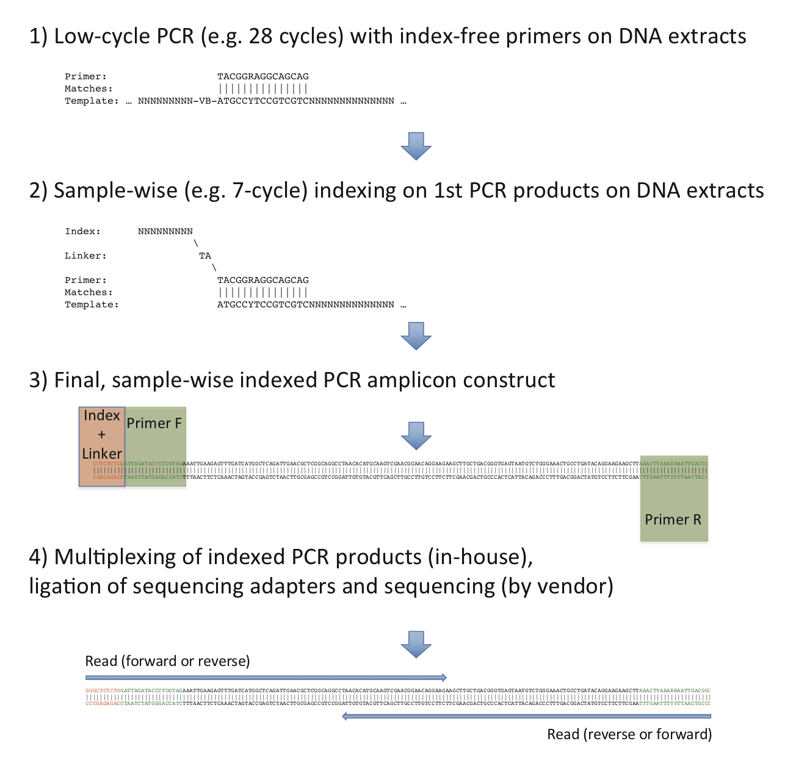

# ***Factors structuring the epiphytic archaeal and fungal communities in a semi-arid Mediterranean ecosystem***
### By Katsoula A, Vasileiadis S, Karamanoli K, Vokou D\*, Karpouzas DG\*
### (\* corr. authors)

This repository contains all the necessary code and instructions for reproducing the results found in our study (see citation section below). We also provide the final OTU matrices with their annotations and the statistical analysis output files (in the output directories of the 5_statistical_analysis folder). The bash code provided in this file can be found as a single script [file](bash_code.sh).

For running the necessary commands the users need to open a terminal, git-clone or download the repository, and enter the base folder. E.g:

```
$ git clone https://github.com/SotiriosVasileiadis/armenistis.git
$ cd armenistis
```
The user, with the "armenistis" folder as working directory, and assumming that the necessary software (described in the next section) is installed, can then run all commands interactively as described here.

The users also need to find the associated databases as described in the manuscript and need to install all R packages found in the **library()** load commands in the provided R scripts at the statistical analysis part.

## Software required for running the various bash script modules

The following software and versions were used for running all scripts along with R packages found in the scripts in the "5_statistical_analysis" sub-folders

[perl v5.32](https://metacpan.org/release/perl)

[Edirect tools v14.2](https://dataguide.nlm.nih.gov/edirect/install.html)

[SRA toolkit v2.10.9](https://github.com/ncbi/sra-tools/wiki/02.-Installing-SRA-Toolkit)

[Flexbar v3.5](https://github.com/seqan/flexbar)

Our own multiplexing system specific demultiplexing Script created by co-author Sotirios Vasileiadis [DemuxOwnBCsys_absPATH.sh](2_demultiplex_data/prok/DemuxOwnBCsys_absPATH.sh) (provided in the supplied material)

[TrimmomaticPE v0.39](http://www.usadellab.org/cms/?page=trimmomatic)

[FLASH v1.2.11](https://ccb.jhu.edu/software/FLASH/#:~:text=FLASH%20is%20designed%20to%20merge,to%20merge%20RNA-seq%20data.)

[LotuS v1.58](http://psbweb05.psb.ugent.be/lotus/)


### 1) Download and merge data in order to mimic the analysis performed in the mansucript


Install the Edirect tools v14.2 according to the instructions of https://dataguide.nlm.nih.gov/edirect/install.html

Enter the 1_download_data folder
```
$ cd 1_download_data
```

Download the bioproject run accessions and create a list
```
$ esearch -db sra -query PRJNA531404 | \
> efetch -format runinfo | \
> cut -d "," -f 1 | grep SRR > SRR_accessions.txt
```

Install the SRA toolkit v2.10.9 according to the instructions of https://github.com/ncbi/sra-tools/wiki/02.-Installing-SRA-Toolkit

Then, download the fastq in split forward/reverse format
```
$ for i in `cat SRR_accessions.txt`
> do
> 	fastq-dump -I --split-files ${i}
> done
```
Concatenate the files to a single library parted by a generic forward reads file and a generic reverse reads file to mimic the files generated by the sequencing center and store them in the 2_demultiplex_data folder
```
$ cat *_1.fastq > ../2_demultiplex_data/R1.fastq
$ cat *_2.fastq > ../2_demultiplex_data/R2.fastq

$ cd ..
```
### 2) Demultiplex data using the script prepared by Sotirios Vasileiadis which is based on the [Flexbar v3.5 software](https://github.com/seqan/flexbar)

Our script is adapted to our multiplexing system able to fish out sample-specific sequences form both the forward and the reverse reads as shown in the figure below. This approach has been used in several of our previous publications [[1-17]](#1:17).


**Figure** ***Schematic of the implemented multiplex sequencing approach.***

Start with the prokaryotes.
```
$ cd 2_demultiplex_data/prok
```
You can test the "DemuxOwnBCsys_absPATH.sh" for necessary arguments with "sh DemuxOwnBCsys_absPATH.sh".
Run the demultiplexing process by calling the "run_demux.sh" bash script which is created by the run_demux_pre.sh script after replacing the absolute path value with the current directory path. 
```
$ perl -pe "s|absolutepath|\\Q${PWD}|g" run_demux_pre.sh | perl -pe "s/\\\//g" > run_demux.sh
```
Attention!!! the generated last two files (last index read pairs) will remain gnu-zipped. This is a minor pipeline glitch and you need to unzip them manually or add some associated commands.
```
$ sh run_demux.sh

$ cd ../../
```
Then delmultiplex the sequences for the fungal dataset.
```
$ cd 2_demultiplex_data/fung
```
You can test the "DemuxOwnBCsys_absPATH.sh" for necessary arguments with "sh DemuxOwnBCsys_absPATH.sh"
Run the demultiplexing process by calling the "run_demux.sh" bash script which is created by the run_demux_pre.sh script after replacing the absolute path value with the current directory path. 
```
$ perl -pe "s|absolutepath|\\Q${PWD}|g" run_demux_pre.sh | perl -pe "s/\\\//g" > run_demux.sh
$ sh run_demux.sh
```
Attention!!! the generated last two files (last index read pairs) will remain gnu-zipped. This is a minor pipeline glitch and you need to unzip them manually or add some associated commands.
```
$ cd ../../
```

### 3) Quality trim the sequence reads with [TrimmomaticPE v0.39](http://www.usadellab.org/cms/?page=trimmomatic) and pair assemble with [FLASH v1.2.11](https://ccb.jhu.edu/software/FLASH/#:~:text=FLASH%20is%20designed%20to%20merge,to%20merge%20RNA-seq%20data.).
```
$ cd 3_qc_trim_pair_assemble/prok

$ for i in `cat mylist`
> 	do
> 	TrimmomaticPE -threads 4 -phred33 ../../2_demultiplex_data/prok/NP2_out/lOTUs_moth_basis/${i}_lib_R1.fastq ../../2_demultiplex_data/prok/NP2_out/lOTUs_moth_basis/${i}_lib_R2.fastq trimmed/${i}_tr_R1.fastq trimmed/${i}_tr_R1_unpaired.fastq trimmed/${i}_tr_R2.fastq trimmed/${i}_tr_R2_unpaired.fastq LEADING:3 TRAILING:3 SLIDINGWINDOW:4:15 MINLEN:100
> 	flash -m 10 -M 250 -x 0.1 -p 33 -d combined_merged -o ${i} --compress-prog=gzip --suffix=gz -t 4 trimmed/${i}_tr_R1.fastq trimmed/${i}_tr_R2.fastq
> 	done

$ cd 3_qc_trim_pair_assemble/fung

$ for i in `cat mylist`
> 	do
> 	TrimmomaticPE -threads 4 -phred33 ../../2_demultiplex_data/fung/NP2_out/lOTUs_moth_basis/${i}_lib_R1.fastq ../../2_demultiplex_data/fung/NP2_out/lOTUs_moth_basis/${i}_lib_R2.fastq trimmed/${i}_tr_R1.fastq trimmed/${i}_tr_R1_unpaired.fastq trimmed/${i}_tr_R2.fastq trimmed/${i}_tr_R2_unpaired.fastq LEADING:3 TRAILING:3 SLIDINGWINDOW:4:15 MINLEN:100
> 	flash -m 10 -M 250 -x 0.1 -p 33 -d combined_merged -o ${i} --compress-prog=gzip --suffix=gz -t 4 trimmed/${i}_tr_R1.fastq trimmed/${i}_tr_R2.fastq
> 	done
```

### 4) Prep of the OTU and taxonomy matrices with [LotuS v1.58](http://psbweb05.psb.ugent.be/lotus/) wrapper.
The outputs per tested microbial group are also provided in the subfolders.
```
$ cd 4_run_lotus/prok
$ lotus.pl -i ../../3_qc_trim_pair_assemble/prok/combined_merged -o lotus_out -m map -p hiSeq -c lOTUs.cfg -s sdm_hiSeq.txt -t lotus_tmp -threads 8 -refDB SLV -tax_group bacteria -amplicon_type SSU -useBestBlastHitOnly 0 -simBasedTaxo 2 -keepUnclassified 1 -LCA_frac 0.3
$ cd ../../

$ cd 4_run_lotus/fung
$ lotus.pl -i ../../3_qc_trim_pair_assemble/fung/combined_merged -o lOTUs_UNITE_8.2 -m map -p hiSeq -c lOTUs_UNITE_8.2.cfg -s sdm_hiSeq.txt -t lotus_tmp -threads 8 -refDB UNITE -tax_group fungi -amplicon_type ITS -useBestBlastHitOnly 0 -simBasedTaxo 2 -keepUnclassified 1 -LCA_frac 0.3
$ cd ../../
```

### 5) Run the statistical analysis

For the performance of this part you need to obtain the OTU.txt and hiera_BLAST.txt files from each LotuS output (or use those originally generated by us and provided in the corresponding folders), place them in the corresponding sub-folders of the "5_statistical_analysis", and run the scripts.R file for [archea](5_statistical_analysis/arch/scripts.R) and [fungi](5_statistical_analysis/fung/scripts.R), or the [ANOVA_qpcr.R](5_statistical_analysis/qpcr_results_stats/ANOVA_qpcr.R) file. As mentioned also previously, it is necessary to install all packages declared in the "library()" package-calling commands throughout the scripts.

The analysis input files can be found in the input subfolders of the tested microbial groups in the 5_statistical_analysis folder. The outputs of the analysis are also provided in the corresponding microbial group subfolders of the 5_statistical analysis folder. Once run natively the resulting outputs will be replaced by the generated outputs.

# Citation of the work of the analyzed dataset.

Katsoula A, Vasileiadis S, Karamanoli K, Vokou D\*, Karpouzas DG\* (under review) Factors structuring the epiphytic archaeal and fungal communities in a semi-arid Mediterranean ecosystem. Microbial Ecology

\* corresponding authors 
vokou@bio.auth.gr, dkarpouzas@uth.gr

# Code usage disclaimer  

The following is the disclaimer that applies to all scripts, functions, one-liners, etc. This disclaimer supersedes any disclaimer included in any script, function, one-liner, etc.

You running this script/function means you will not blame the author(s) if this breaks your stuff. This script/function is provided **AS IS** without warranty of any kind. Author(s) disclaim all implied warranties including, without limitation, any implied warranties of merchantability or of fitness for a particular purpose. The entire risk arising out of the use or performance of the sample scripts and documentation remains with you. In no event shall author(s) be held liable for any damages whatsoever (including, without limitation, damages for loss of business profits, business interruption, loss of business information, or other pecuniary loss) arising out of the use of or inability to use the script or documentation. Neither this script/function, nor any part of it other than those parts that are explicitly copied from others, may be republished without author(s) express written permission. Author(s) retain the right to alter this disclaimer at any time. This disclaimer was copied from a version of the disclaimer published by other authors in https://ucunleashed.com/code-disclaimer and may be amended as needed in the future.

# Referenced literature

<a id="1">[1]</a>
Christou, M L, Vasileiadis, S, Kalamaras, S D, Karpouzas, D G, Angelidaki, I, Kotsopoulos, T A (2020). Ammonia-induced inhibition of manure-based continuous biomethanation process under different organic loading rates and associated microbial community dynamics. Bioresour Technol, 124323, https://doi.org/10.1016/j.biortech.2020.124323

<a id="2">[2]</a>
Diquattro, S, Garau, G, Mangia, N P, Drigo, B, Lombi, E, Vasileiadis, S, Castaldi, P (2020). Mobility and potential bioavailability of antimony in contaminated soils: Short-term impact on microbial community and soil biochemical functioning. Ecotoxicol Environ Saf 196, 110576, https://doi.org/10.1016/j.ecoenv.2020.110576

<a id="3">[3]</a>
Kalamaras, S D, Vasileiadis, S, Karas, P, Angelidaki, I, Kotsopoulos, T A (2020). Microbial adaptation to high ammonia levels during anaerobic digestion of manure-based feedstock; Biomethanation and 16S rRNA gene sequencing. J Chem Technol Biotechnol https://doi.org/10.1002/jctb.638510.1002/jctb.6385

<a id="4">[4]</a>
Katsoula, A, Vasileiadis, S, Sapountzi, M, Karpouzas, D G (2020). The response of soil and phyllosphere microbial communities to repeated application of the fungicide iprodione: Accelerated biodegradation or toxicity? FEMS Microbiol Ecol https://doi.org/10.1093/femsec/fiaa05610.1093/femsec/fiaa056

<a id="5">[5]</a>
Ogbughalu, O T, Vasileiadis, S, Schumann, R C, Gerson, A R, Li, J, Smart, R S C, Short, M D (2020). Role of microbial diversity for sustainable pyrite oxidation control in acid and metalliferous drainage prevention. J Hazard Mater 393, 122338, https://doi.org/10.1016/j.jhazmat.2020.122338

<a id="6">[6]</a>
Papadopoulos, C, Karas, P A, Vasileiadis, S, Ligda, P, Saratsis, A, Sotiraki, S, Karpouzas, D G (2020). Host Species Determines the Composition of the Prokaryotic Microbiota in Phlebotomus Sandflies. Pathogens 9, 428, https://doi.org/10.3390/pathogens9060428

<a id="7">[7]</a>
Vasileiadis, S, Perruchon, C, Scheer, B, Adrian, L, Steinbach, N, Trevisan, M, Plaza-Bolanos, P, Aguera, A, Chatzinotas, A, Karpouzas, D G (2020). Nutritional inter-dependencies and a carbazole-dioxygenase are key elements of a bacterial consortium relying on a Sphingomonas for the degradation of the fungicide thiabendazol. bioRxiv 10.1101/2020.03.30.015693, 2020.2003.2030.015693, https://doi.org/10.1101/2020.03.30.015693

<a id="8">[8]</a>
Soldi, S, Vasileiadis, S, Lohner, S, Uggeri, F, Puglisi, E, Molinari, P, Donner, E, Sieland, C, Decsi, T, Sailer, M, Theis, S (2019). Prebiotic supplementation over a cold season and during antibiotic treatment specifically modulates the gut microbiota composition of 3-6 year-old children. Beneficial Microbes 0, 1-11, https://doi.org/10.3920/bm2018.0116

<a id="9">[9]</a>
Suciu, N, Vasileiadis, S, Puglisi, E, Pertile, G, Tourna, M, Karas, P Α, Papolla, A, Ferrarini, A, Sulowic, S, Fornasier, F, Lucini, L, Karpouzas, D G, Trevisan, M (2019). Azadirachtin and trifloxystrobin had no inhibitory effects on key soil microbial functions even at high dose rates. Appl Soil Ecol 137, 29-38, https://doi.org/10.1016/j.apsoil.2019.01.016

<a id="10">[10]</a>
Hassan, H, Jin, B, Donner, E, Vasileiadis, S, Saint, C, Dai, S (2018). Microbial community and bioelectrochemical activities in MFC for degrading phenol and producing electricity: Microbial consortia could make differences. Chem Eng J 332, 647-657, https://doi.org/10.1016/j.cej.2017.09.114

<a id="11">[11]</a>
Lohner, S, Jakobik, V, Mihályi, K, Soldi, S, Vasileiadis, S, Theis, S, Sailer, M, Sieland, C, Berényi, K, Boehm, G, Decsi, T (2018). Inulin-type fructan supplementation of 3 to 6 year-old children is associated with higher fecal bifidobacterium concentrations and fewer febrile episodes requiring medical attention. The Journal of Nutrition 148, 1300-1308, https://doi.org/10.1093/jn/nxy120

<a id="12">[12]</a>
Mandal, S, Donner, E, Vasileiadis, S, Skinner, W, Smith, E, Lombi, E (2018). The effect of biochar feedstock, pyrolysis temperature, and application rate on the reduction of ammonia volatilisation from biochar-amended soil. Sci Total Environ 627, 942-950, https://doi.org/10.1016/j.scitotenv.2018.01.312

<a id="13">[13]</a>
Vasileiadis, S, Puglisi, E, Papadopoulou, E S, Pertile, G, Suciu, N, Pappolla, R A, Tourna, M, Karas, P A, Papadimitriou, F, Kasiotakis, A, Ipsilanti, N, Ferrarini, A, Sułowicz, S, Fornasier, F, Menkissoglu-Spiroudi, U, Nicol, G W, Trevisan, M, Karpouzas, D G (2018). Blame it on the metabolite: 3,5-dichloraniline rather than the parent compound is responsible for decreasing diversity and function of soil microorganisms. Appl Environ Microbiol 84, e01536-01518, https://doi.org/10.1128/aem.01536-18

<a id="14">[14]</a>
Garau, G, Silvetti, M, Vasileiadis, S, Donner, E, Diquattro, S, Deiana, S, Lombi, E, Castaldi, P (2017). Use of municipal solid wastes for chemical and microbiological recovery of soils contaminated with metal(loid)s. Soil Biol Biochem 111, 25-35, https://doi.org/10.1016/j.soilbio.2017.03.014

<a id="15">[15]</a>
Algora, C, Vasileiadis, S, Wasmund, K, Trevisan, M, Kruger, M, Puglisi, E, Adrian, L (2015). Manganese and iron as structuring parameters of microbial communities in Arctic marine sediments from the Baffin Bay. FEMS Microbiol Ecol https://doi.org/9110.1093/femsec/fiv056

<a id="16">[16]</a>
Soldi, S, Vasileiadis, S, Uggeri, F, Campanale, M, Morelli, L, Fogli, M, Calanni, F, Grimaldi, M, A, G (2015). Modulation of the gut microbiota composition by rifaximin in non-constipated irritable bowel syndrome patients: a molecular approach. Clinical and Experimental Gastroenterology 8, 309-325, https://doi.org/10.2147/CEG.S89999

<a id="17">[17]</a>
Vasileiadis, S, Puglisi, E, Trevisan, M, Scheckel, K G, Langdon, K A, McLaughlin, M J, Lombi, E, Donner, E (2015). Changes in soil bacterial communities and diversity in response to long-term silver exposure. FEMS Microbiol Ecol 91, fiv114, https://doi.org/10.1093/femsec/fiv114